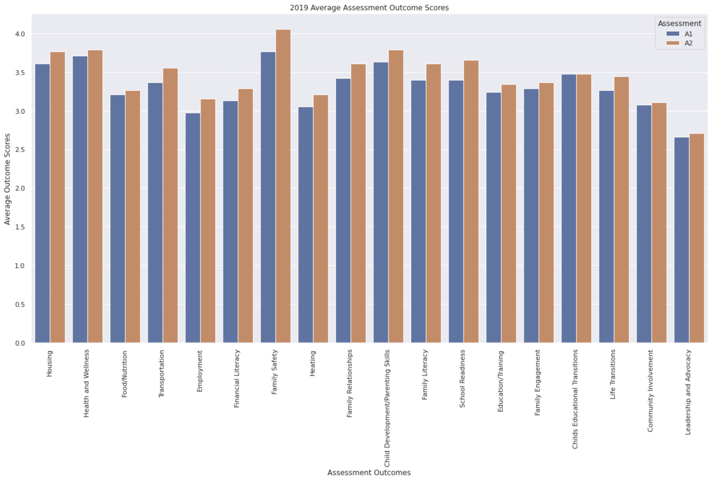
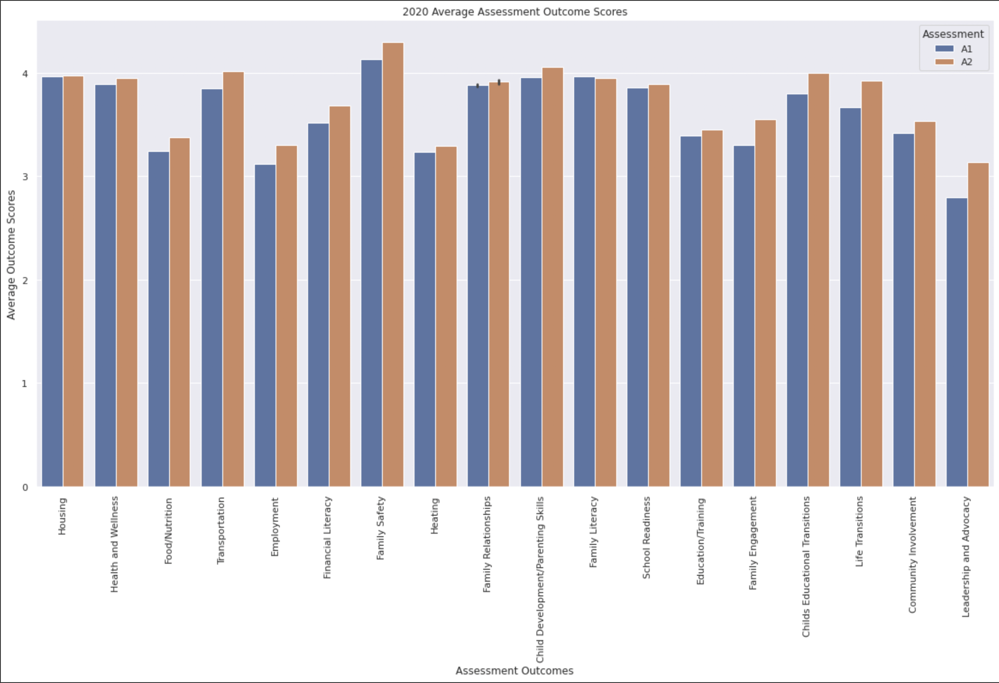
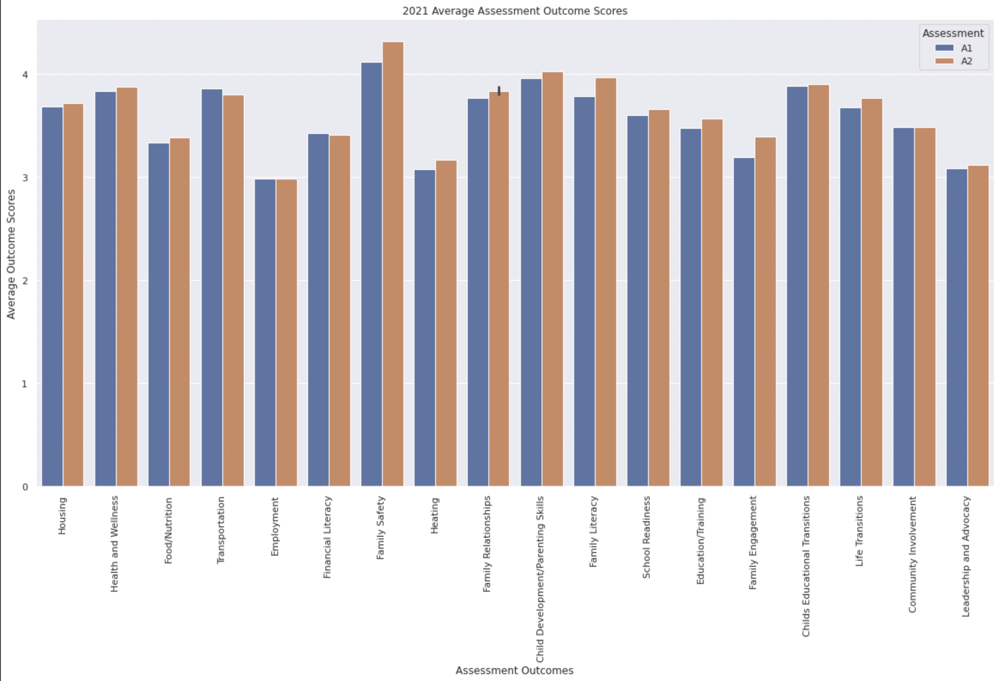
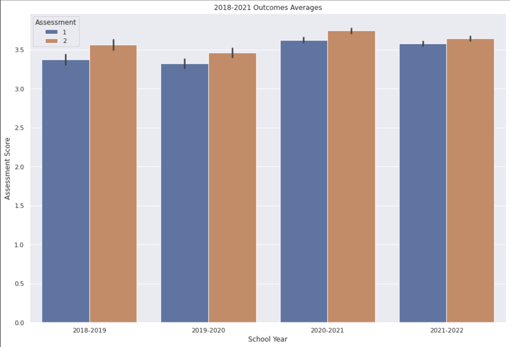
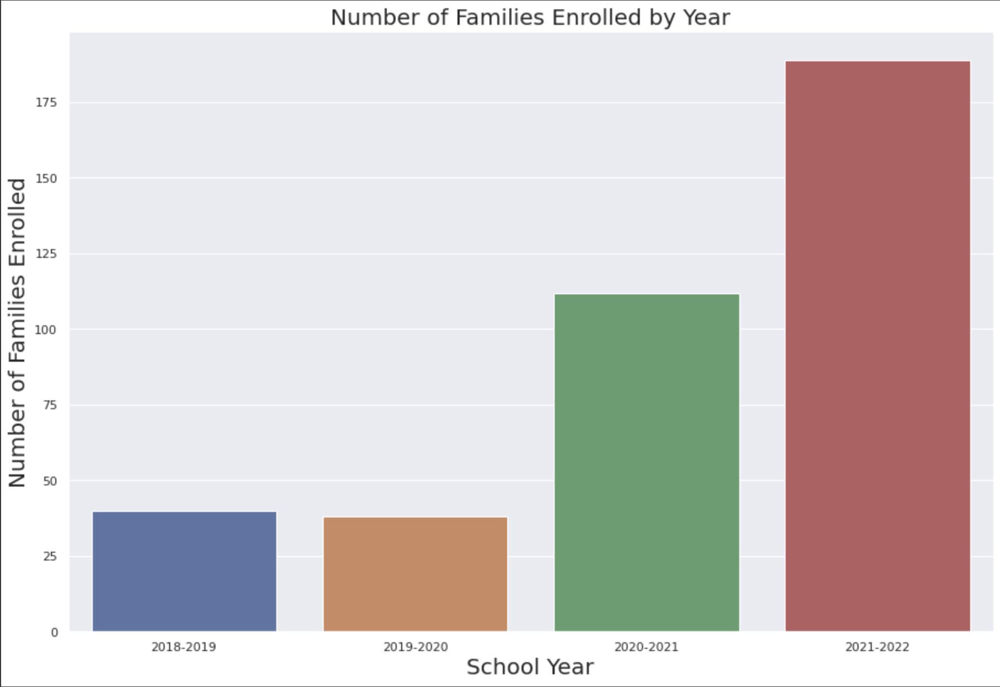
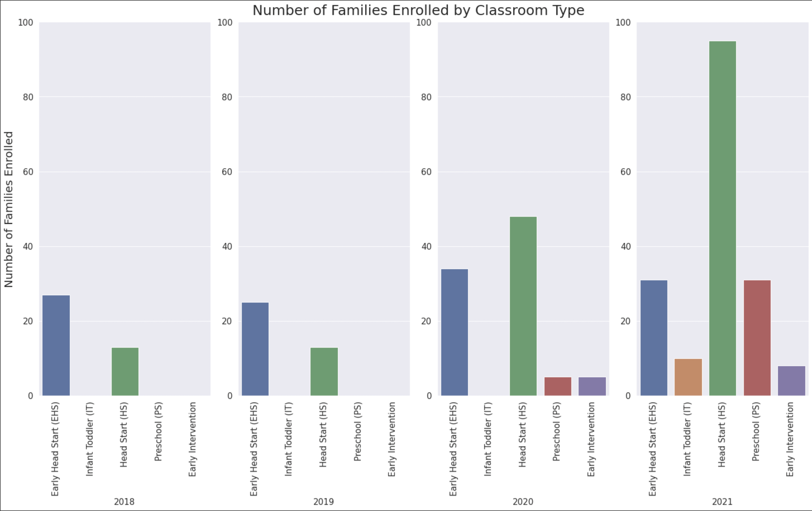
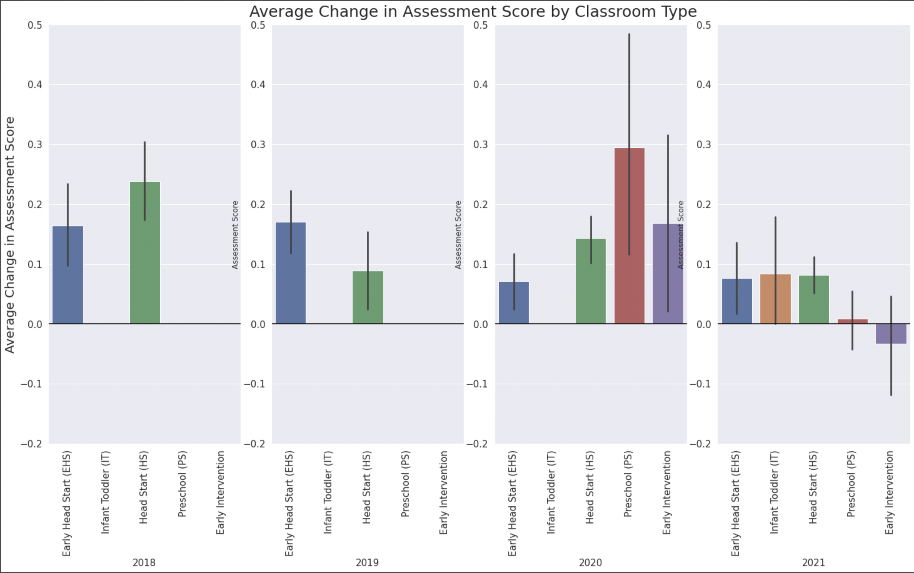

# Project (ACAP-ME)

# Exploring ACAP Family Outcomes

## NOTE to students

This repository provides a fictional example of a project proposal for DS5110, Summer 2022.
It's based on the [vaccines project](http://ds5010/vaccines) completed by Portland students in 
the Spring 2022 version of DS 5010.
Their project was eventually put in a publicly accessible repository and included a 
github-pages (gh-pages) site: [ds5010.github.io/vaccines](ds5010.github.io/vaccines).
You can use this repo as guidance for creating your own project proposal.
Additional guidance is in the [course repo](https://github.com/ds5110/summer-2022/blob/main/projects/projects.md).

## Project partners

* Jennifer Wen
* Evan Chan

## Goal

The project goal is to evaluate how family outcomes within ACAP-ME's program changes over the past four years.
We can see if the scores were affected by the pandemic in the 2020 school year.
We'll start by looking at how average families scores change and seeing if there is any correlation between different outcome categories.
If families are enrolled in the program over multiple years, we can investigate the outcome trends for those families.

## Data

Primary sources of data will be from our stakeholder form ACAP.


## Stakeholder

Jamie Chandler


## Preliminary Results

2018 Assesment Outcome Averages


```
python src/Assessment_Outcome_Averages_by_Year.py
```

2019 Assesment Outcome Averages


```
python src/Assessment_Outcome_Averages_by_Year.py
```

2020 Assesment Outcome Averages


```
python src/Assessment_Outcome_Averages_by_Year.py
```

2021 Assesment Outcome Averages


```
python src/Assessment_Outcome_Averages_by_Year.py
```

Combined Assesment Outcome Averages


```
python src/Combined_Years_Assessment_Averages.py
```

Number of Families Enrolled by Year


```
python src/Number_Families_by_Year.py
```

Number of Families Enrolled by Classroom Type


```
python src/Number_Families_by_Classroom_Type.py
```

Average Change in Assessment Score by Classroom Type


```
python src/Average_Change_Score_by_Classroom_Type.py
```


## Project plan

*ask for clarification*
- ask about duplicate families in the same sheet
- ask about different programs/classrooms
- ask about report average, families with complete assessments
- +/- rows

