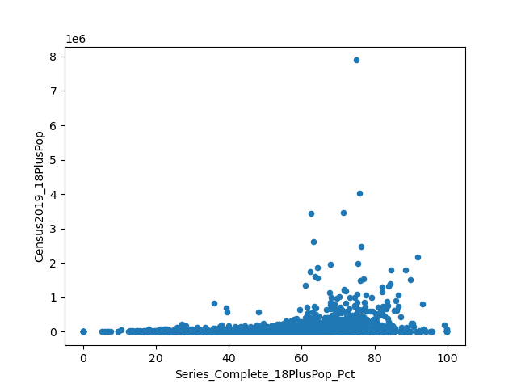

# Project (template)

# Exploring COVID-19 Vaccine Effectiveness

This fictional example is based on reality.

## NOTE to students

This repository provides a fictional example of a project proposal for DS5110, Summer 2022.
It's based on the [vaccines project](http://ds5010/vaccines) completed by Portland students in 
the Spring 2022 version of DS 5010.
Their project was eventually put in a publicly accessible repository and included a 
github-pages (gh-pages) site: [ds5010.github.io/vaccines](ds5010.github.io/vaccines).
You can use this repo as guidance for creating your own project proposal.
Additional guidance is in the [course repo](https://github.com/ds5110/summer-2022/blob/main/projects/projects.md).

## Project partners

* Student #1 (identify partner by name -- the entire team should use this partner's github-classroom repo for the project)
* Student #2 (ditto)
* Student #3 (ditto)

## Goal

The project goal is to develop a predictive model for COVID-19 vaccine effectiveness 
at the county level based on death rate and possibly other socioeconomic factors.
We'll start by investigating the relationship between 
vaccination rate and death rate. 
We'll be careful to determine time-dependence, since vaccines were rolled out in May 2021 and 
probably had their maximum effectiveness the following November, as mentioned
in [this NPR story](https://www.npr.org/sections/health-shots/2021/12/05/1059828993/data-vaccine-misinformation-trump-counties-covid-death-rate), which is where we developed the idea for this project.

## Data

Primary sources of data will be CDC and Johns Hopkins university.

* [CDC](https://data.cdc.gov/Vaccinations/COVID-19-Vaccinations-in-the-United-States-County)
* [Johns Hopkins](https://github.com/CSSEGISandData/COVID-19)

## Stakeholder

This could be a faculty member or someone from an organization with an interest in this problem who
would be willing to provide feedback on your prototypes.

## Preliminary result

The figure shows vaccination rate versus population for each county in the U.S. 
It was created using a CSV file downloaded from obtained from the CDC site listed above.



Recreate this figure with the following command:

```
python src/app.py
```

## Project plan

[plan.md](plan.md)
