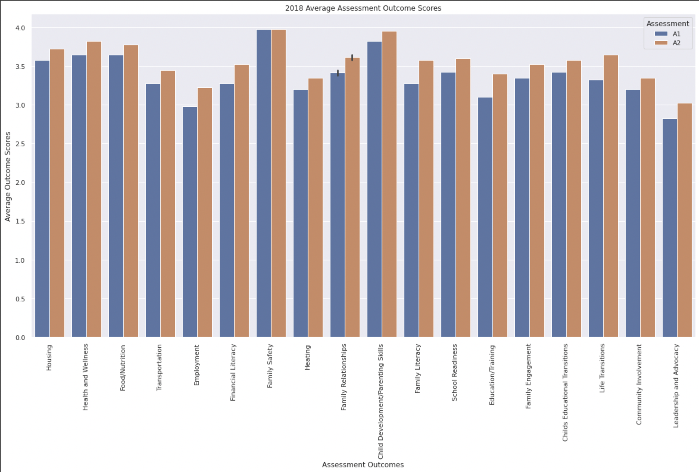
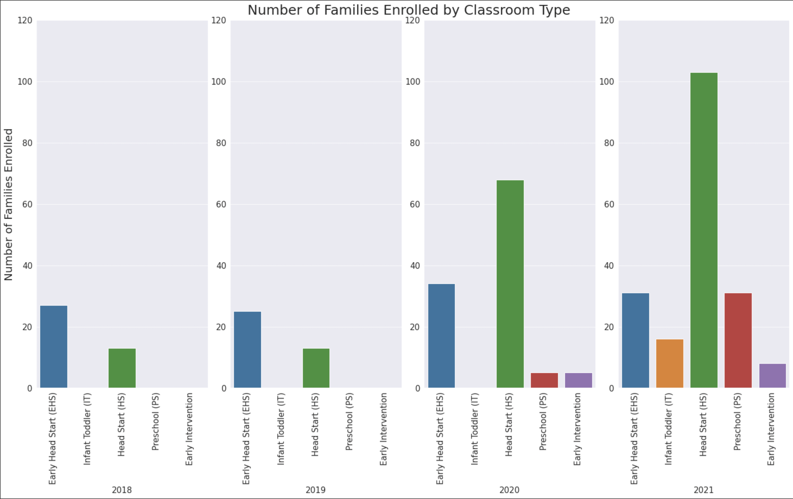

# Project (ACAP-ME)

# Exploring ACAP Family Outcomes

## Project partners

* Jennifer Wen
* Evan Chan

## Goal

The project goal is to evaluate how family outcomes within ACAP-ME's program changes over the past four years.
We received ChildPlus assessment scores from families in their coaching programs. The assessments are done twice a school year, once at the beginning and once at the end. The use of assessments was piloted in the 2018-2019 and 2019-2020 school years and expanded from there.
We can use this data to evaluate changes in families' lives and possible impact ACAP has on families as well as get an idea of the growth of the program over time.
We can also see if the scores were affected by the pandemic in the 2020 school year.
We'll start by looking at how average families scores change between different outcome categories.

## Data

Primary sources of data will be from our stakeholder form ACAP. Cleaned and re-formatted versions of the files are in the acap_me folder.


## Stakeholder

Jamie Chandler


## Results

2018 Assesment Outcome Averages


```
python src/Assessment_Outcome_Averages_2018.py
```

2019 Assesment Outcome Averages


```
python src/Assessment_Outcome_Averages_2019.py
```

2020 Assesment Outcome Averages


```
python src/Assessment_Outcome_Averages_2020.py
```

2021 Assesment Outcome Averages


```
python src/Assessment_Outcome_Averages_2021.py
```

Combined Assesment Outcome Averages


```
python src/Combined_Years_Assessment_Averages.py
```

Number of Families Enrolled by Year


```
python src/Number_Families_by_Year.py
```

Number of Families Enrolled by Classroom Type


```
python src/Number_Families_by_Classroom_Type.py
```

Average Change in Assessment Score by Classroom Type


```
python src/Average_Change_Score_by_Classroom_Type.py
```

Average Change in Assessment Score by Region


```
python src/Average_Change_Score_by_Region.py
```

Number of Families Enrolled by Region


```
python src/Number_Families_by_Region.py
```


## Cleaning the data
Because of the format of the original data, we had to remove family names for privacy and reformat everything in a way that can can be interpreted in a dataframe. 

To remove the family names, the names were replaced with the family ID number assigned to them by ChildPlus.
The code to clean out the familiy names (original file with family names not included) run is in the acap_me folder:

```
acap_me/app.py
```

We had to remove formatting that made the data easier for humans to read. We looked for keywords in the lines that we needed to remove and also filled in the data about classrooms and forward filled it to each family in that classroon.
To reformat data to a usable file run:
```
python acap_me/organize.py
```

## Project plan


