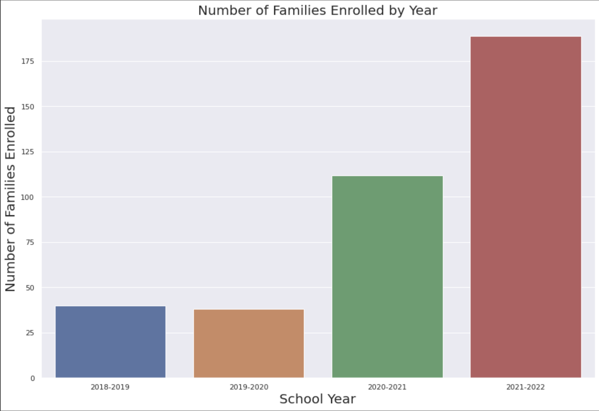
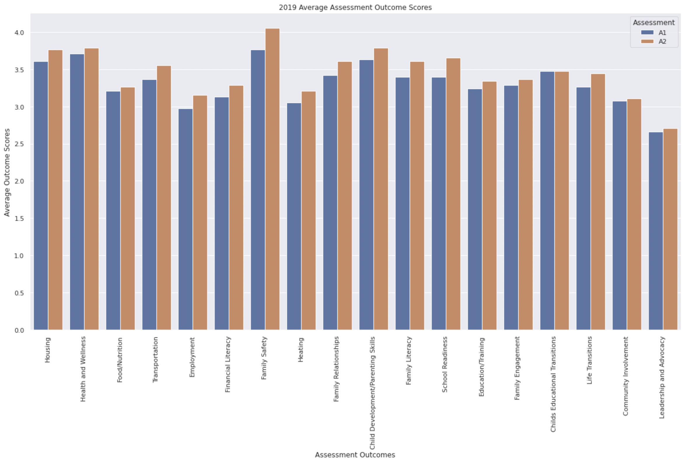
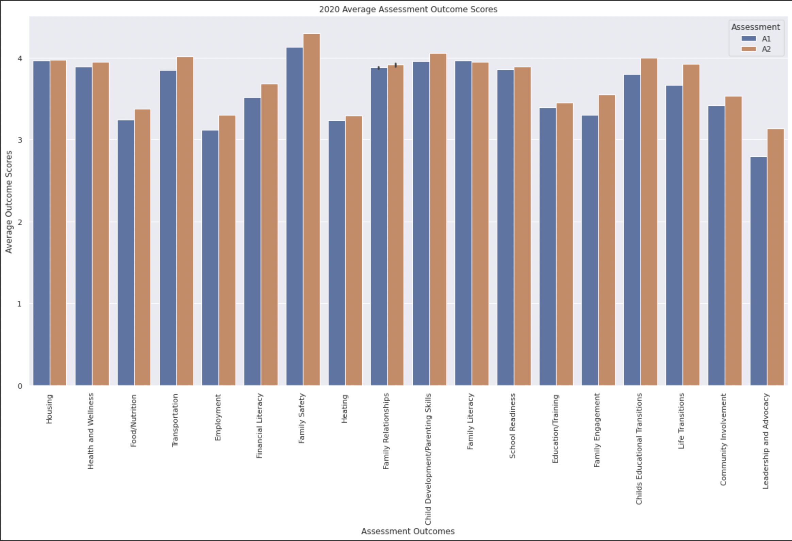
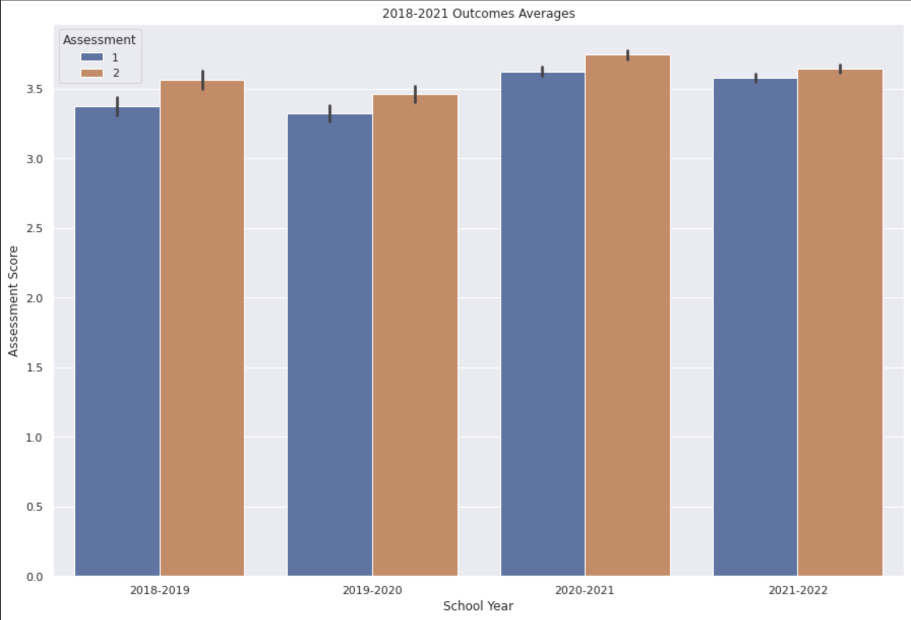
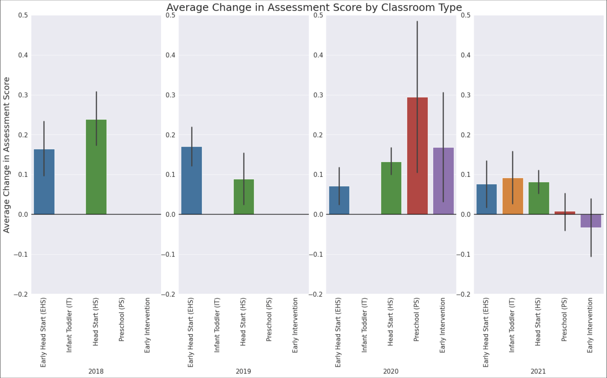
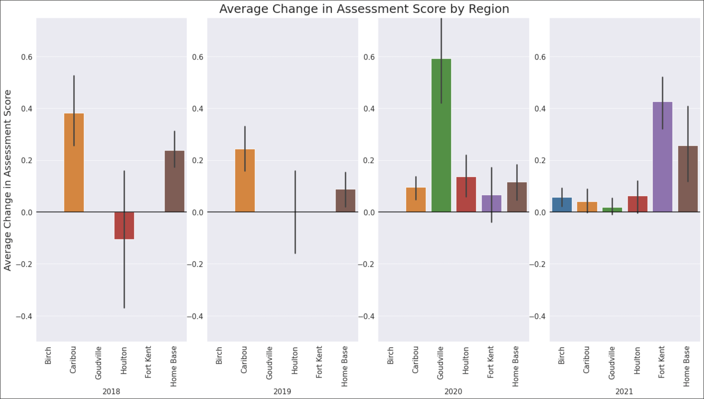

# Project (ACAP-ME)

# Exploring ACAP Family Outcomes

## Project partners

* Jennifer Wen
* Evan Chan

## Goal

The project goal is to evaluate how family outcomes within ACAP-ME's program changes over the past four years.
We received ChildPlus assessment scores from families in their coaching programs. The assessments are done twice a school year, once at the beginning and once at the end. The use of assessments was piloted in the 2018-2019 and 2019-2020 school years and expanded from there.
We can use this data to evaluate changes in families' lives and possible impact ACAP has on families as well as get an idea of the growth of the program over time.
We can also see if the scores were affected by the pandemic in the 2020 school year.
We'll start by looking at how average families scores change between different outcome categories.

## Data

Primary sources of data will be from our stakeholder form ACAP. Cleaned and re-formatted versions of the files are in the acap_me folder.

## Stakeholder

Jamie Chandler

## Results

The following graph shows the number of families enrolled who filled out the Assessment over the years. This shows the growth of the program each year. It reflects the additional classrooms and coaching team growth.
Number of Families Enrolled by Year

The following 4 graphs show the average scores for the outcomes in Assessment 1 and Assessment 2 over the last 4 school years:

2018 Assesment Outcome Averages

2019 Assesment Outcome Averages

2020 Assesment Outcome Averages

2021 Assesment Outcome Averages

We can see that between Assessment 1 and Assessment 2 the scores are usually increasing. Scores for Employment may be lower because of the eligibility requirements for some of the services. Heating scores may be lower because of the cold climate. Heating is needed from October through March.

The following graph shows the combine averages of all the outcomes, which we see increasing, on average, between Assessment 1 and 2.
Combined Assesment Outcome Averages

Number of Families Enrolled by Classroom Type

Early Head Start (EHS) and Infant/Toddler (IT) include children under 3. 
EHS has eligibility guidelines. IT is fee for services.
Head Start (HS), Preschool (PS) and Early Intervention (EI) are for children 3-5.
HS has eligibilty guidelines. PS is fee for services. EI is for children with developmental delays.

Average Change in Assessment Score by Classroom Type

Average Change in Assessment Score by Region

Number of Families Enrolled by Region

